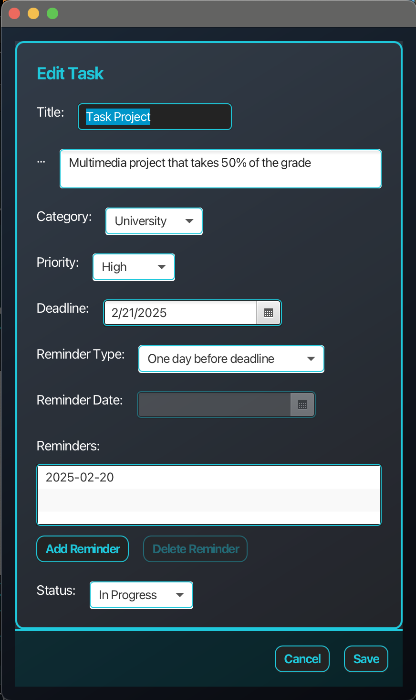
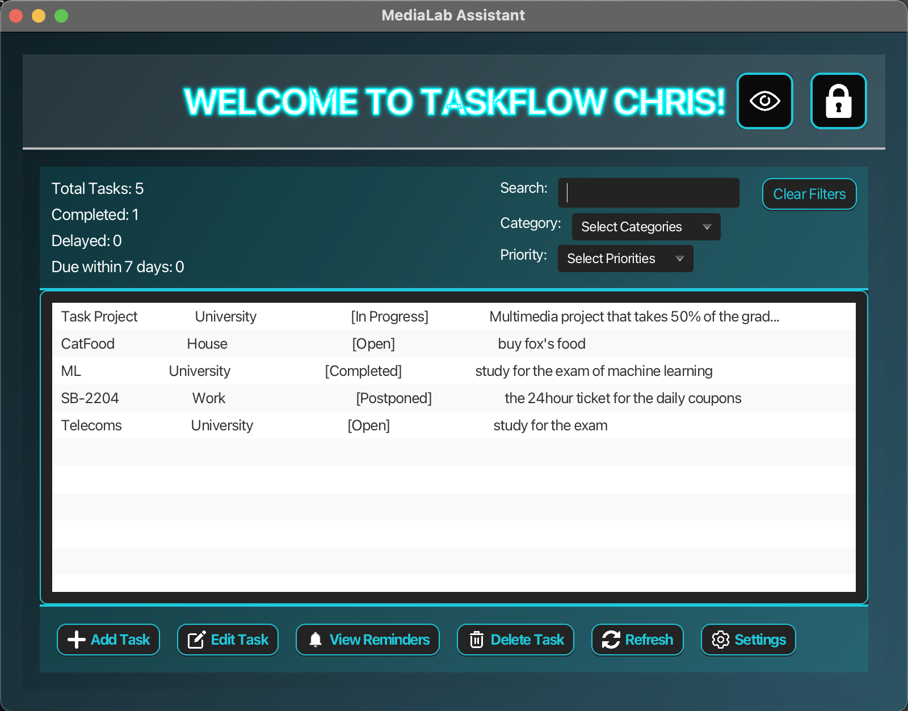
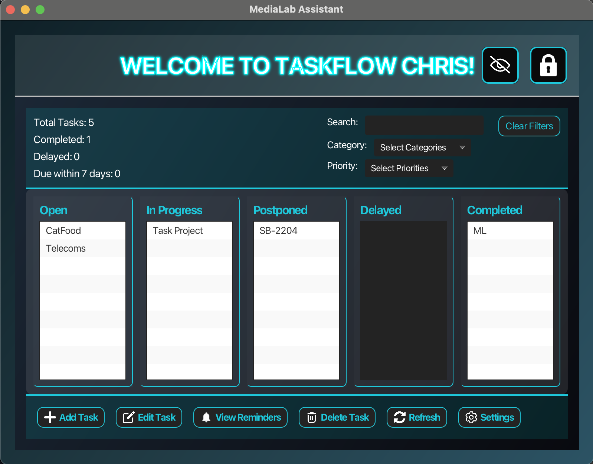
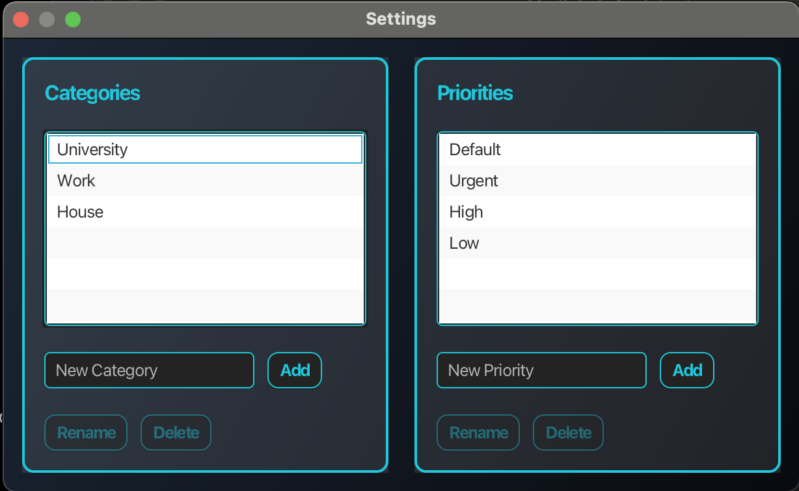

# Task Management System  

**Project - Multimedia Technology**  
**Christodoulos Stylianidis**  

---

## Overview  

Below are screenshots that showcase key aspects of the application:  

### Main Interface  

| Edit Task (Left)                  | Task List (Top Right)          |
|-----------------------------------|--------------------------------|
|  |  |

| Tasks Per Status (Bottom Right)   |
|-----------------------------------|
|  |

---

### Settings Menu  

  

---

## Installation  

This application was developed using **Visual Studio Code**. Follow the steps below to set up and run the project:  

### 1. Install JDK  
- **Windows**: [Download JDK for Windows](https://download.oracle.com/java/23/latest/jdk-23_windows-x64_bin.exe)  
- **Mac**: [Download JDK for Mac](https://download.oracle.com/java/23/latest/jdk-23_macos-aarch64_bin.dmg)  

### 2. Clone the Repository  
```bash
git clone https://github.com/ntua-el20614/task-managment-system.git
```

### 3. Initialize and Run the Application  
- **Windows**:  
```bash
./init_windows.sh
./run_windows.sh
```
- **Mac**:  
```bash
./init_mac.sh
./run_mac.sh
```

---

## Design and Implementation  

The application follows **Object-Oriented Programming (OOP)** principles and is based on the **MVC architecture** with the following structure:  

- **Models**: Classes representing application objects, such as:  
  - `Task`  
  - `User`  
- **Controllers**: Classes handling the logic and functionality of FXML files.  
- **Views**: FXML files defining the graphical interface.  
- **Utils**: Helper methods and implementations for alert screens.  

The **UI** was built using **Scene Builder**.  

---

## Data Storage and Retrieval  

All application data is stored in a single `users.json` file located in the `medialab` folder. The file structure includes users, tasks, categories, and priorities.  

Example of the file for two users, where one has a task with two reminders:  

```json
[
  {
    "username": "chris",
    "passwordHash": "$2a$10$aD5EsmzOfEIswtAdAt8ZeuKIN6Tiiz6mwL6pP0gCzW7o6su5HUd8.",
    "tasks": [],
    "categories": [],
    "priorities": [
      "Default"
    ]
  },
  {
    "username": "john",
    "passwordHash": "$2a$10$ZTX/q44f4fyMuNBVFUYs/udP..5eHTDY5lzZyYz2ujLP6X4k7/vQe",
    "tasks": [
      {
        "id": "cba546c1-69bb-4c25-a3e6-c5bdf2d06c24",
        "title": "Multimedia",
        "description": "complete the project for multimedia",
        "category": "University",
        "priority": "Default",
        "deadline": "2025-02-21",
        "status": "Open",
        "reminders": [
          "2025-02-14",
          "2025-01-26"
        ]
      }
    ],
    "categories": [
      "University",
      "Work"
    ],
    "priorities": [
      "Default",
      "Urgent"
    ]
  }
]
```

The file is dynamically loaded and updated during application execution.  

---

## Assumptions  

- Each new user starts with no categories and a single priority, **"Default"**.  
- **Reminders for the current day** are displayed only when the user logs in (though they can be revisited through the "View Reminders" option).  

---

## User Interface  

- At the top-right of the interface, the user can switch between task categorization **by status** or as a single **list** view.  
- Upon logging in, the user is alerted about tasks where the **deadline has passed** (excluding completed tasks). Following this, today's reminders are displayed.  

---

### Settings  

From the **Settings** menu, users can:  
- Add, edit, or remove their custom categories and priorities.  
